# Rick and Morty List

I created a list of Rick and Morty character list using React, a bit of CSS and this [API](https://rickandmortyapi.com/documentation). 

 

> ### You can find my project [here](https://rad-clafoutis-3ef283.netlify.app/)

 

## Wireframe and planning 

 

## Technology used
- Languages used:
    - CSS
    - React
- Developer Tools:
    - Command Line
    - Visual Studio Code
    - Google Chrome
- Deployment: 
    -  [Netify](https://www.netlify.com/)
- Wireframing Tool:
    - Canva

 

## User Stories
***
As a user, I should be able to:
- [x] search for characters
- [x] filter through characters based on their status
- [x] add characters to my favourite list
- [x] remove character from favourite list
- [x] empty favourite list
- [x] see more information about the character I clicked 
- [x] add my own character to the screen
- [x] edit character card by giving the character a nickname 

 

## Overview
***
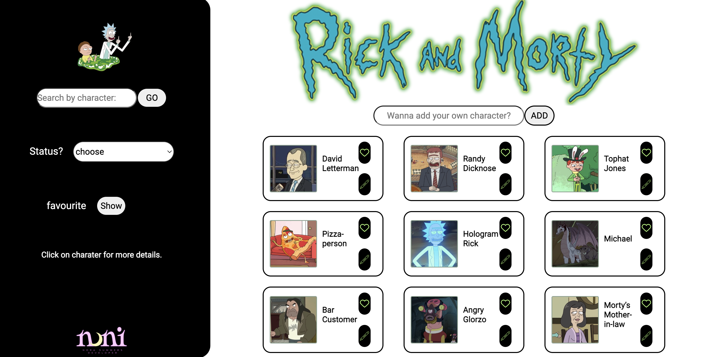

### Structure

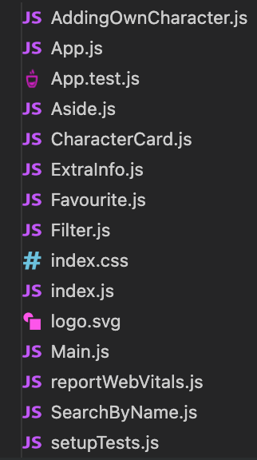

1. index 
2. App
    - Aside
        - search
        - filter
        - favourite
        - extra info
    - Main
        - character cards
        - adding your own character
 

### Building Process
- First I started by creating the wireframe to visualise what I want the outcome to look like.
- I set up my components and created a static version of the app.
- Then I created a function for each of these components.
- Afterwards I added a bit of styling.

 

### Components

 
    
 
      App
    

    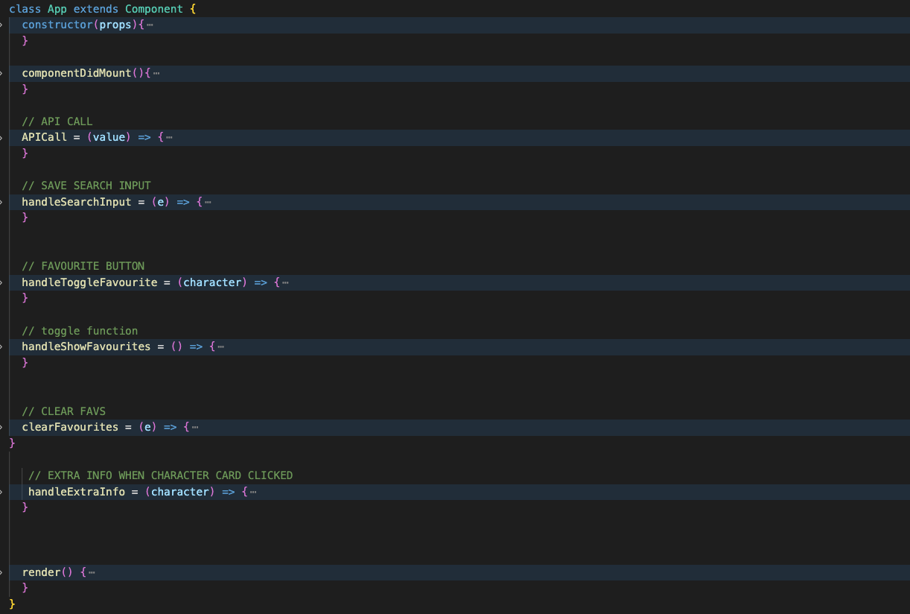

 
    
 
      Aside
    

    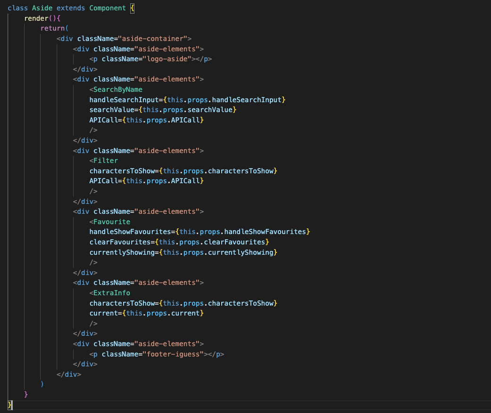

 
    
 
      Search
    

    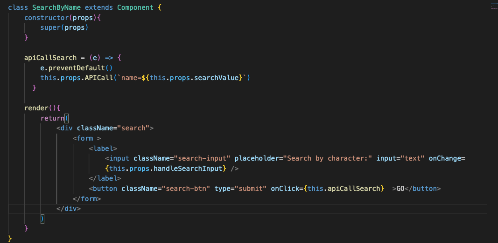

 
    
 
      Filter
    

    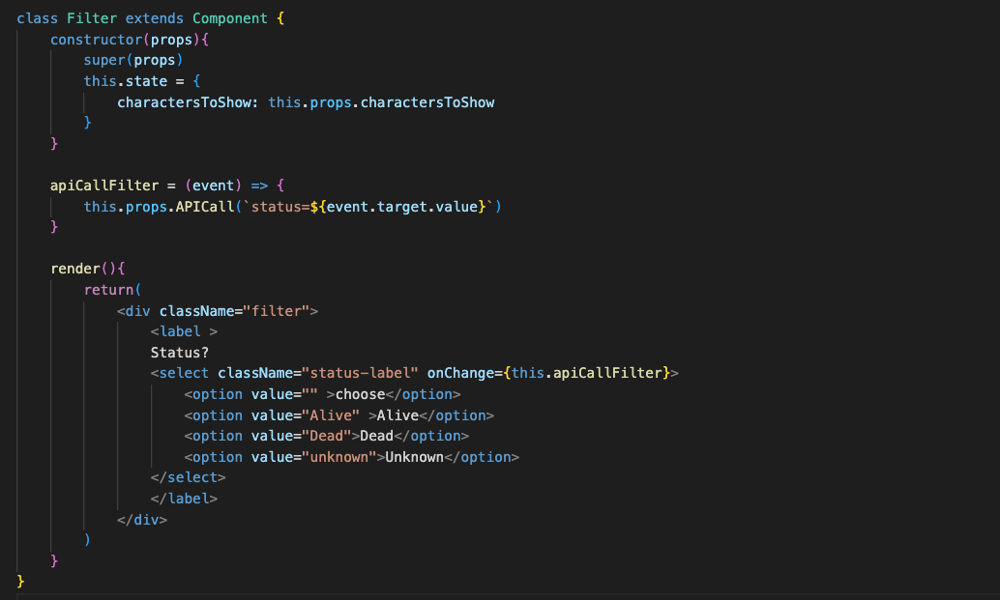

 
    
 
      Favourite
    

    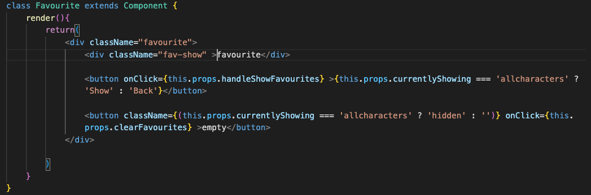

 
    
 
      Extra info
    

    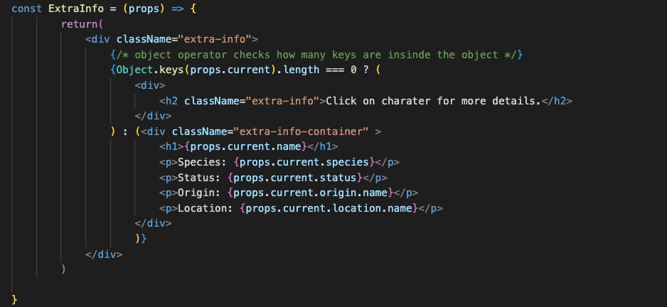

 
    
 
      Main
    

    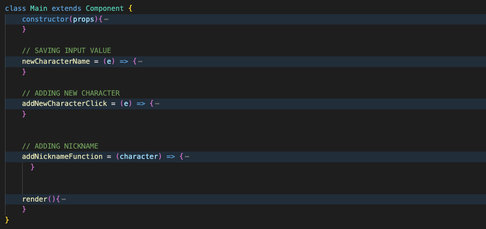

 
    
 
      Character Cards
    

    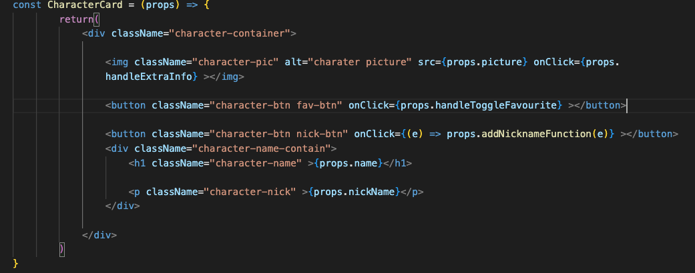

 
    
 
      Add Extra Character
    

    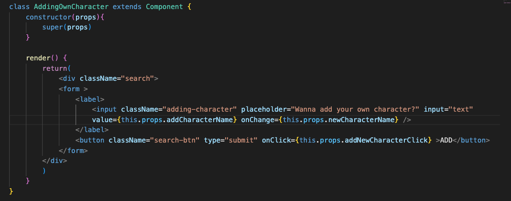

 

## Challenges
This is my very first React Project so building something from scratch itself was a pretty big challenge itself.

- I had to draw a 'tree' of the components to visualise where to place each function. 
- I find it challanging to think about setting states and using these to make certain elements work on the app but eventually I put something together.

 

## Key Learning
1. I need to focus executing a code and not spending hours on what would be the best practice. Then when it is working focusing on how to make it more officiant.

2. I need to learn to step away from the screen and take breaks because it is crucial for my brain to be able to function well throughout the week so I will not burn out in 48 hours.

3. If you can’t find the answer written online then try asking teachers or peers before watching hours and hours worth of videos on Youtube just to end up asking a human about your problem.

 

## Future Improvements 
- Adding local storage
- Making the website responsive with a better layout
- Adding new background picture when the favourite button is pressed
- Adding option to choose your character picture
- Adding an all button
- Adding pagination to be able to display all characters

 

## Bugs
- The search and filter components work seperatly 
- You have to re fresh the page every time you want to go back to the 9 main randomly displayed pictures.
