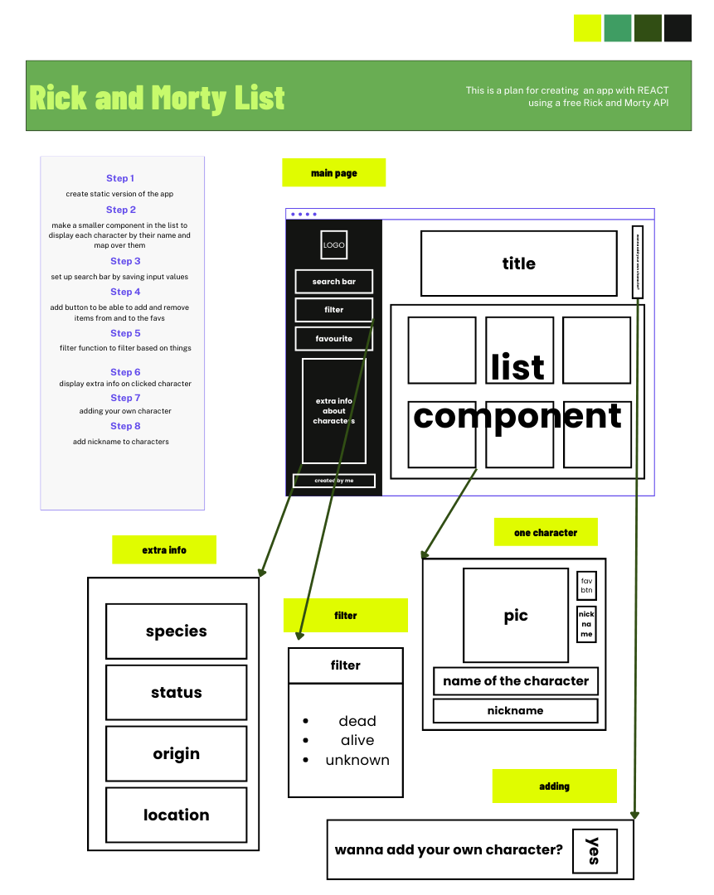
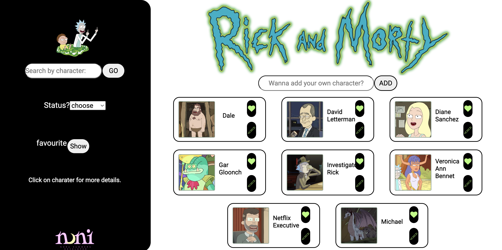

# Rick and Morty List

I created a list of Rick and Morty character list using this [API](https://rickandmortyapi.com/documentation). 

 

> ### You can find my project [here](https://rad-clafoutis-3ef283.netlify.app/)

 

## Wireframe and planning 

 

## Technology used
- Languages used:
    - CSS
    - React
- Developer Tools:
    - Command Line
    - Visual Studio Code
    - Google Chrome
- Deployment: 
    -  [Netify](https://www.netlify.com/)
- Wireframing Tool:
    - Canva

 

## User Stories
***
As a user, I should be able to:
- [x]  search for characters
- [x] filter through characters based on their status
- [x] add characters to my favourite list as well as empty this list
- [x] see more information about the character I clicked 
- [x] add my own character to the screen

 

## Overview
***

### Structure
1. index
2. App
    - Aside
        - add character
        - search
        - filter
        - fav
        - extra info
    - Main
        - character cards
        - adding your own character
 

### Building Process
- First I started by creating the wireframe to visulise what I want the outcome to look like.
- I set up my components and created a static version of the app.
- 

## Challenges

## Wins

## Key Learning

## Future Improvements 

## Bugs

